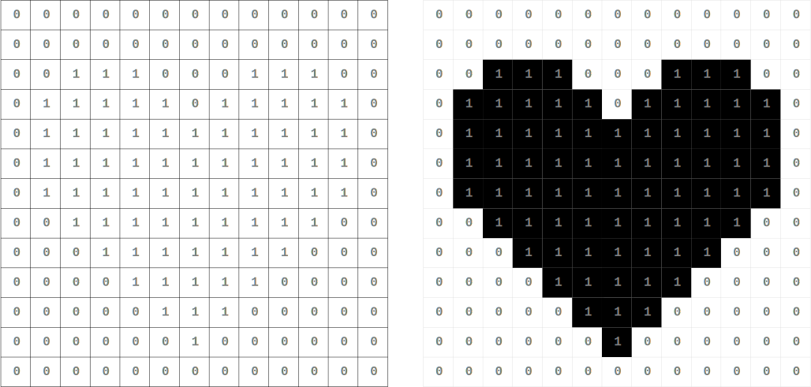

# pixel_raster_xpm
Create a pixel raster representation of an image (for educational purposes).

This code is not very robust and not well tested.
You should use [pixel_raster](https://github.com/Lapizistik/pixel_raster) instead. The only advantage compared to `pixel_raster` is that it does not
need ImageMagick and RMagick.

## Bits and pixels

A digital (pixel) image simply is a number of bits in a given format.
It encodes the size (width and height) of the image, i.e. how many
columns and rows of pixels the image consists of as well as the color
(and saturation and brightness) of each pixel.

The most easy case is a black and white image where each pixel is
represented by one bit.

## A paint yourself binary pixel image 

To explain how an image is represented as data it can help to show
paint-yourself raster versions (see [images.pdf](images.pdf)).

## xpm2tikz

The script takes xpm images from the command line as input and
outputs [tikz](https://ctan.org/pkg/pgf)-code to stdout.

See `xpm2tikz -h`.
